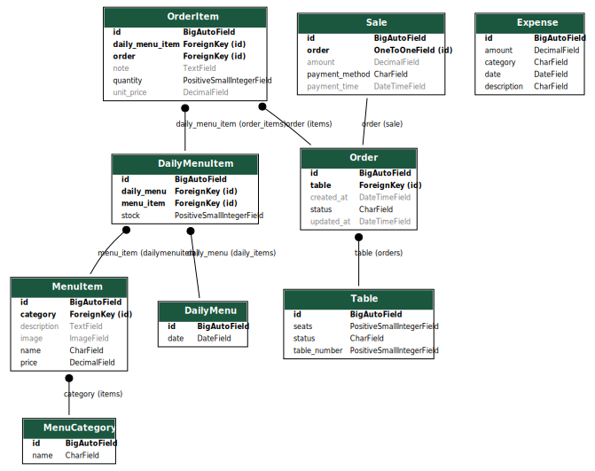

# 🍽️ **Restaurant System – ER Diagram Design**

## 🧾 `MenuItem`

Represents general dish info (name, description, price, image, etc.)

- `id` (PK)
- `name`
- `description`
- `price`
- `image` _(optional, with fallback)_
- `category` (FK → `MenuCategory`)
- `is_available` _(global availability, not daily)_

## 📂 `MenuCategory`

Classifies menu items into categories (e.g. "Entrees", "Desserts").

- `id` (PK)
- `name`

## 📅 `DailyMenu`

Defines the active menu for a specific day.

- `id` (PK)
- `date` (unique)

## 📋 `DailyMenuItem`

Links a `MenuItem` to a `DailyMenu`, with per-day availability and stock.

- `id` (PK)
- `daily_menu` (FK → `DailyMenu`)
- `menu_item` (FK → `MenuItem`)
- `stock` (initial units available)
- `is_available` _(for that day)_

## 🪑 `Table`

Represents a restaurant table.

- `id` (PK)
- `table_number`
- `seats`
- `status` (`available`, `occupied`, `reserved`)

## 🛒 `Order`

A customer order linked to a table.

- `id` (PK)
- `table` (FK → `Table`)
- `created_at`
- `updated_at`
- `status` (`pending`, `in_progress`, `served`, `paid`, `cancelled`)

## 🍽️ `OrderItem`

An item in an order, linked to a specific `DailyMenuItem`.

- `id` (PK)
- `order` (FK → `Order`)
- `daily_menu_item` (FK → `DailyMenuItem`)
- `quantity`
- `unit_price`
- `note`

## 💳 `Sale`

Represents payment info for an order.

- `id` (PK)
- `order` (OneToOne FK → `Order`)
- `payment_method` (`cash`, `card`, `pix`)
- `amount`
- `payment_time`

## 💰 `Expense`

Tracks outgoing money.

- `id` (PK)
- `description`
- `amount`
- `category` (`inventory`, `salary`, `maintenance`, `other`)
- `date`

## 📊 `Report`

(Not a model — defined via queries/views to summarize data)

- Daily/weekly/monthly sales
- Best-selling dishes
- Remaining stock
- Profit (sales - expenses)

## 🔗 Relationships Summary

- One `MenuCategory` → many `MenuItems`
- One `DailyMenu` → many `DailyMenuItems`
- One `MenuItem` → many `DailyMenuItems`
- One `DailyMenuItem` → many `OrderItems`
- One `Table` → many `Orders`
- One `Order` → many `OrderItems`
- One `Order` → one `Sale`
- Expenses are standalone
