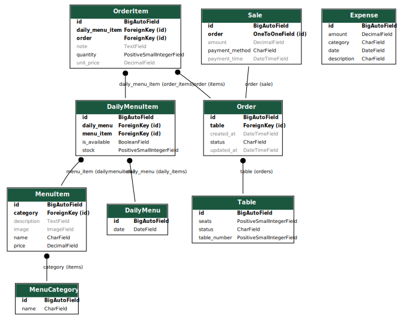

# Project Roadmap: Restaurant Management System

## Overview

### 1. Menu Management

- **Dish model** with fields like name, description, category, price, availability.
- **Daily Menu** model to select dishes for each day.
- Stock/availability tracking per day (like you mentioned previously).

### 2. Orders

- Support for dine-in and takeaway.
- Order model with status (e.g., pending, preparing, served, canceled, paid).
- Ordered items with quantity, price snapshot, notes.
- Optional: assign to a table (linked with table management).

### 3. Sales and Invoicing

- Automatically generate invoices when orders are paid.
- Track payments (cash, card, etc.).
- Optional: discounts, taxes.

### 4. Expenditures

- Record purchases (e.g., ingredients, supplies).
- Categories of spending (e.g., food, maintenance, salaries).
- Attach receipts/files.
- Optional: recurring expenses.

### 5. Reporting

- Sales per day/week/month.
- Most sold dishes.
- Profit vs expenses.
- Best clients (if implementing authentication).
- Optional: export to CSV, Excel, or PDF.

### 6. Table Management

- Manage restaurant tables (table number, capacity).
- Current status (available, reserved, occupied).
- Assign orders to tables.

### 7. User Management

- Staff roles (waiter, cook, admin).
- Admin dashboard (using Django admin or a custom frontend).
- Authentication with JWT (already in your stack).

### 8. Background Tasks

- Use Celery for:
  - Sending order notifications.
  - Daily report generation.
  - Automatic archival of old records.

## Tech Stack & Tools

- **Django + DRF** for backend logic and APIs.
- **PostgreSQL** for database.
- **Redis + Celery** for background tasks and caching.
- **Docker** for development environment.
- **drf-spectacular** for API docs.
- **django-silk / django-debug-toolbar** for optimization.
- **Poetry** for package management.

## Project Plan

### Phase 1: Environment Setup & Base Project

**Goal:** Establish your dev environment with Poetry, Docker, and PostgreSQL.

**Tasks:**

- Create a Poetry-managed Django project.
- Set up `docker-compose` for Django + PostgreSQL.
- Create apps:
  - `menu`, `orders`, `tables`, `sales`, `expenses`, `users`, `reports`
- Set up `.env` for config and connect DB.
- Configure Git with `.gitignore`.

**Tools:** Poetry, Docker, Git, PostgreSQL

---

### Phase 2: Models & Admin Setup

**Goal:** Define your database structure and set up admin panel for management.

```shell
py manage.py graph_models menu orders tables sales expenses > models.dot

# Then copy output code in https://dreampuf.github.io/GraphvizOnline/?engine=dot
```



**Tasks:**

- Design models for:
  - Menu Items, Categories
  - Orders and OrderItems
  - Tables (with status)
  - Sales & Invoices
  - Expenses (supplies, salaries)
- Add `__str__`, model methods (`get_absolute_url`, properties).
- Admin customization (filters, inlines, read-only fields).
- Model constraints (e.g., `unique_together`, `CheckConstraint`).

**Concepts Used:**

- Migrations, Admin UI, Validators, Relationships (FK, M2M), Proxy Models

---

### Phase 3: Django Views, URLs, and Templates

**Goal:** Create full CRUD using Django templates and CBVs.

**Tasks:**

- Use Django **Class-Based Views**:
  - `ListView`, `DetailView`, `CreateView`, `UpdateView`, `DeleteView`
- Integrate **ModelForms** and form validation.
- Build **HTML templates** for each app.
- Use Django **Messages Framework** for feedback (success/error).
- Add authentication views (login, logout, user permissions).
- Apply basic styling (Bootstrap, Tailwind, or minimal CSS).

**Concepts Used:**

- CBVs, ModelForms, Django Templates, Messages, Auth System

---

### Phase 4: Business Logic & Query Optimization

**Goal:** Implement and optimize core features like reports, filters, and performance.

**Tasks:**

- Write custom queries using:
  - `annotate()`, `aggregate()`, `F`, `Q`, `Case`, `When`
- Optimize views with:
  - `select_related`, `prefetch_related`, `django-debug-toolbar`
- Create business logic:

  - Track daily sales, profits, expenses
  - Menu availability logic
  - Table status updates

  **Concepts Used:**

- ORM expressions, Aggregation, Filtering, Debugging, N+1 Problem

---

### Phase 5: Roles & Permissions

**Goal:** Implement role-based access control using Django’s auth system.

**Tasks:**

- Create roles: admin, cashier, cook, waiter.
- Restrict views/templates by user role.
- Use Django’s **`User` model** + custom profile if needed.
- Decorate views with `@login_required`, `user_passes_test`, or class-based equivalents.

**Concepts Used:**

- Django Permissions, Groups, `request.user`, Custom access logic

---

### Phase 6: Reporting Interface

**Goal:** Enable staff to view business insights.

**Tasks:**

- Build template views for:
  - Daily/weekly/monthly sales
  - Best-selling items
  - Expenses per category
  - Table usage
- Add filters (date range, category).
- Export to CSV or JSON (optional).

**Concepts Used:**

- Aggregations, Custom views, CSV rendering, Query filters

---

### Phase 7: Caching & Performance

**Goal:** Optimize heavy-read endpoints and reduce DB load.

**Tasks:**

- Install and configure **Redis**.
- Use:
  - `cache_page`, `cache.get/set`, or template caching.
  - `Vary` headers (e.g., user role vs public)
- Cache menu queries and reports.
- Add expiration logic or manual invalidation.

**Concepts Used:**

- Redis, Django Caching, Template fragment caching, Vary Headers

---

### Phase 8: Background Tasks with Celery

**Goal:** Introduce asynchronous task processing for reporting, maintenance, etc.

**Tasks:**

- Install **Celery** and configure with Redis.
- Add periodic tasks with Celery Beat:
  - Auto archive old orders
  - Daily profit email to owner (optional)
  - Pre-warm cache
- Create asynchronous tasks for bulk processing.

**Concepts Used:**

- Celery, Redis, Async tasks, Periodic jobs

---

### Phase 9: Migrate to DRF (API Refactor)

**Goal:** Rebuild backend using DRF for frontend/API clients.

**Tasks:**

- Refactor Django views into **DRF ViewSets**.
- Use:
  - Serializers (nested, `SerializerMethodField`)
  - Permissions (admin vs staff)
  - `django-filter`, pagination, search
- Document API using **drf-spectacular** or **Swagger**.

**Concepts Used:**

- DRF Serializers, ViewSets, Filtering, Auth, Documentation

---

### Phase 10: React Frontend Integration

**Goal:** Create a modern frontend to consume your new API.

**Tasks:**

- Scaffold React app (Vite, CRA, etc.).
- Use `axios` or `fetch` to consume your DRF endpoints.
- Create components for:
  - Orders
  - Menu browsing
  - Reports dashboard
  - Login / auth token handling
- Deploy separately (e.g., Netlify, Vercel).

**Concepts Used:**

- REST API consumption, JWT Auth, React state management

---

### Bonus: Testing & Deployment

**Goal:** Ensure your app is maintainable and ready for production.

**Tasks:**

- Write tests for models, forms, and views.
- Test DRF endpoints using Django’s test tools.
- Polish README with instructions and screenshots.
- Deploy backend with:

  - Railway / Render / VPS
  - Gunicorn + Nginx + PostgreSQL

**Concepts Used:**

- Unit tests, API tests, Deployment configs

py manage.py startapp menu
py manage.py startapp orders
py manage.py startapp tables
py manage.py startapp sales
py manage.py startapp expenses
py manage.py startapp reports
